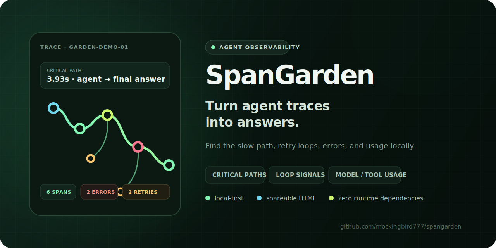

<div align="center">

# 🌱 SpanGarden

### Grow raw agent traces into answers you can act on.

**A local-first CLI for critical paths, a high-confidence Recovery Ledger, retry loops, model/tool usage, tokens, latency, and opt-in cost estimates.**

[](https://github.com/mockingbird777/spangarden/actions/workflows/ci.yml)
[](https://mockingbird777.github.io/spangarden/)
[](https://nodejs.org/)
[](LICENSE)
[](package.json)

[**Explore the live report →**](https://mockingbird777.github.io/spangarden/) · [Quick start](#quick-start) · [Input adapters](#input-adapters) · [Privacy](#privacy-by-default)

</div>

---



**SpanGarden answers the questions raw traces leave open: where did the run stall, which failed attempts were verifiably recovered, what did that recovery consume, and what can you safely share?**

Agent traces are rich and awkward: nested spans, vendor-shaped attributes, retries that look like normal calls, and token numbers without context. SpanGarden turns those exports into one reproducible report on your machine—no collector, database, Docker image, account, or cloud upload.

```text
  SPANGARDEN  SpanGarden agent trace report
  ──────────────────────────────────────────────────────────────
  1 traces   6 spans   2 errors   2 recovered retries
  2 retry candidates   1 loop signals
  2.85s wall time   p50 280ms   p95 2.85s
  3,420 in / 1,196 out tokens

  CRITICAL PATHS
  garden-demo-01  3.93s  agent.plan_trip → chat final answer

  RECOVERY LEDGER
  tool:weather:execute_tool  trace garden-demo-01  parent root
    failed weather-1  190ms  tokens unknown  cost unknown
    failed weather-2  250ms  tokens unknown  cost unknown
    recovered by weather-3 (ok, 280ms)  tokens unknown  cost unknown
      final delay 80ms  recovery latency 680ms

  USAGE
  model  orchid-2                   1 calls     1.08s  0 err
  model  orchid-2-mini              1 calls      680ms  0 err
  tool   weather                    3 calls      720ms  2 err

  LOOP SIGNALS
  repeated siblings  tool:weather  [weather-1 → weather-2 → weather-3]
```

## Why SpanGarden

| Question | Signal |
|---|---|
| Where did the run spend time? | Per-trace trees, wall time, p50/p95, and longest root-to-leaf critical path |
| Which failures actually recovered? | A conservative Recovery Ledger that requires matching trace, parent, operation identity, and non-overlapping chronology |
| Is the agent stuck? | Recursive-path and repeated-sibling loop signals plus retry candidates |
| Which tools and models dominate? | Deterministic call, error, latency, and token rollups |
| What might this run cost? | Estimates from **your local pricing JSON only**—never stale bundled prices |
| Can I share the report? | Sensitive-key and credential-pattern redaction is on by default; HTML embeds encoded data |
| Will this become infrastructure? | No daemon, no network calls, and zero runtime dependencies |

## Quick start

Get the result above from a built-in synthetic OpenTelemetry trace—no trace file, backend, or API key required:

```bash
npx --yes github:mockingbird777/spangarden --demo
```

Turn the same demo into a portable interactive report, or analyze your own export:

```bash
npx --yes github:mockingbird777/spangarden --demo --format html --output spangarden-report.html
npx --yes github:mockingbird777/spangarden ./trace.json --format html --output report.html
```

Both commands run with Node.js 20+. Open the generated HTML file directly in a browser; it contains the report, styles, and interaction code in one file and loads no remote assets.

Or clone for repeat use:

```bash
git clone https://github.com/mockingbird777/spangarden.git
cd spangarden
npm ci
npm run build
node dist/src/cli.js examples/agent-run.json --pricing examples/pricing.json
```

Generate every report shape:

```bash
spangarden run.jsonl --format terminal
spangarden run.json.gz --format json --output report.json
spangarden run.json --format markdown --output investigation.md
spangarden run.json --format html --output investigation.html
spangarden run.json --output report.html          # format inferred from the extension
cat run.jsonl | spangarden - --format json
```

The HTML report is one portable file with search, kind filters, critical-path highlighting, a Recovery Ledger, usage tables, and loop evidence. It loads no remote assets.

## Where it fits

| Approach | Best at | What SpanGarden adds |
|---|---|---|
| Hosted observability backend | Always-on ingestion, retention, alerting, and team dashboards | A local investigation path with no service, account, or upload |
| Raw OTel viewer | Inspecting individual spans and attributes | Agent-aware critical paths, auditable recovered retries, model/tool rollups, token totals, and opt-in cost arithmetic |
| One-off scripts | Answering one question for one trace shape | Tolerant adapters, deterministic reports, default redaction, and four stable output formats |
| SpanGarden | Fast local diagnosis and shareable artifacts | Zero runtime dependencies and one self-contained interactive HTML report |

SpanGarden is an investigation tool, not a collector, long-term trace store, billing system, or production alerting platform.

## What it analyzes

- Parent/child span forests, including missing-parent and cyclic-input recovery
- Longest duration-weighted root-to-leaf path per trace
- Model and tool calls, errors, durations, input tokens, and output tokens
- High-confidence recovered retry sequences with failed attempts, the non-failed span that recovered them, failed duration, final retry delay, and recovery latency
- Repeated siblings as retry candidates; three or more as a loop signal
- Repeated operations along an ancestor path as a recursive-loop signal
- Trace wall time and p50/p95 span latency
- Optional per-model cost estimates with priced/unpriced token accounting

### Recovery Ledger confidence boundary

The Recovery Ledger is deliberately stricter than the general retry heuristic. It records a recovery only when all of this evidence is present:

1. Every attempt has the same `traceId` and an explicit, identical `parentSpanId`.
2. Every attempt has a stable normalized signature: an explicit tool identity, or a model identity plus operation identity. A matching span name alone is never enough.
3. All spans in that operation group are serial. If any sibling intervals overlap or share the same start time, the entire group is omitted instead of guessing which call retried which.
4. One or more `error` spans are followed by a span not marked as an error. Its original `ok` or `unset` status remains visible; SpanGarden does not invent a success status.
5. Usable timing exists for the whole group. Timing-free groups are omitted with a report note.

The normalized `operationSignature` is `tool:<tool>[:<gen_ai.operation.name>]` for explicit tool spans and `model:<model>:<gen_ai.operation.name-or-span-name>` for explicit model spans. Its parts are trimmed, whitespace-normalized, and case-folded. Generic name-only spans do not get a Recovery Ledger signature.

Each entry keeps the failed span IDs and the `recoveredBy` span ID so the conclusion can be checked against the raw trace. `failedDurationMs` is the sum of failed-attempt durations. `retryDelayMs` is the gap from the last failure ending to the recovery attempt starting. `recoveryLatencyMs` runs from the first failure ending until the recovery attempt ends.

Token counts appear only when non-zero token evidence exists. Per-attempt and failed-work cost estimates appear only when a matching rate from the user-supplied local pricing file exists; terminal, Markdown, and HTML reports say `unknown`, while JSON omits unavailable optional fields. SpanGarden never backfills missing telemetry.

A shortened priced JSON entry looks like this:

```json
{
  "schemaVersion": "1.1",
  "summary": { "recoveredRetries": 1 },
  "recoveryLedger": [
    {
      "traceId": "trace-a",
      "parentSpanId": "agent-run",
      "operationSignature": "model:alpha:chat",
      "failedAttempts": [
        {
          "spanId": "attempt-1",
          "status": "error",
          "durationMs": 240,
          "inputTokens": 800,
          "outputTokens": 20,
          "estimatedCostUsd": 0.00176
        }
      ],
      "recoveredBy": {
        "spanId": "attempt-2",
        "status": "ok",
        "durationMs": 310,
        "inputTokens": 800,
        "outputTokens": 90,
        "estimatedCostUsd": 0.00232
      },
      "failedDurationMs": 240,
      "retryDelayMs": 75,
      "recoveryLatencyMs": 385,
      "failedInputTokens": 800,
      "failedOutputTokens": 20,
      "estimatedFailedCostUsd": 0.00176
    }
  ]
}
```

Loop evidence is bounded to 1,000 findings and 100 span IDs per finding so adversarial repetition cannot multiply report size without limit; a report note appears when evidence is clipped.

Loop and general retry results are deliberately labeled **signals** and **candidates**. Recovery Ledger entries have stronger structural and chronological evidence, but still describe telemetry—not application intent.

## Input adapters

SpanGarden accepts regular JSON, newline-delimited JSON, and gzip files ending in `.gz`. The adapter searches these common containers:

- OpenTelemetry `resourceSpans → scopeSpans → spans`
- Legacy `instrumentationLibrarySpans`
- Generic `spans`, `traces`, `runs`, `events`, `children`, and `steps`
- Top-level span arrays and JSONL span records

Common snake_case and camelCase IDs, parents (including `parent_run_id`), timestamps, durations, statuses, models, tools, and token fields are normalized. Explicit durations are read from `durationMs`/`duration_ms`/`latency_ms` (milliseconds) or, as a fallback, `durationNs`/`duration_ns` (nanoseconds, converted to ms); when none are present, duration is derived from start and end timestamps. OpenTelemetry attribute arrays, `arrayValue`, and `kvlistValue` wrappers are decoded. Nested generic children inherit their enclosing trace and parent even when the enclosing span needs a generated ID. Unknown attributes stay in the report instead of being thrown away.

Minimal generic input:

```json
{
  "spans": [
    { "id": "run", "trace_id": "t1", "name": "agent.run", "start_time": 0, "duration_ms": 840 },
    { "id": "llm", "parent_id": "run", "trace_id": "t1", "name": "chat", "model": "my-model", "duration_ms": 620, "input_tokens": 900, "output_tokens": 220 }
  ]
}
```

Timestamp support includes ISO strings, millisecond numbers, and OpenTelemetry Unix nanosecond fields with sub-millisecond precision where JavaScript numbers permit it. When timestamps are absent, analysis continues and adds a warning.

## Programmatic API

The packed ESM entry point exposes the same adapter, analysis, formatting, input, pricing, and redaction primitives used by the CLI:

```bash
npm install github:mockingbird777/spangarden
```

```js
import { adaptSpans, analyzeSpans, formatReport } from "spangarden";

const report = analyzeSpans(adaptSpans(rawTrace));
const markdown = formatReport(report, "markdown");
```

## Local pricing

SpanGarden does **not** ship or fetch model prices. Supply rates you have reviewed:

```json
{
  "currency": "USD",
  "models": {
    "my-model": { "inputPerMillion": 2, "outputPerMillion": 8 },
    "*": { "inputPerMillion": 0.5, "outputPerMillion": 1.5 }
  }
}
```

```bash
spangarden trace.json --pricing pricing.json --format html -o report.html
```

Exact model names are preferred, matching is case-insensitive, and `*` is an optional fallback. Unmatched tokens are reported as unpriced in aggregate usage and remain `unknown` in Recovery Ledger cost fields. Estimates are arithmetic aids, not billing records.

## Privacy by default

SpanGarden performs no network requests. Before output, it redacts sensitive-looking keys such as prompts/message content, authorization headers, token/key/email fields, passwords, cookies, private keys, and session IDs. It also masks common bearer credentials, OpenAI/GitHub/Slack/Google/AWS credentials, JWTs, email addresses, private-key blocks, and secret-bearing URL parameters inside strings. The same protection is applied to report metadata, aggregate labels, and credential-shaped identifiers; affected identifiers become stable one-way aliases so parent and critical-path links remain intact.

Token **count** fields are preserved. Redaction can miss domain-specific data, so inspect artifacts before sharing them. Markdown text and terminal controls are neutralized, and the self-contained HTML uses encoded data, DOM text nodes, and a restrictive Content Security Policy.

```bash
# Only for controlled local debugging; a warning is written to stderr.
spangarden trace.json --no-redact
```

Input is bounded to 128 MiB **after gzip decompression** by default. Change the limit explicitly:

```bash
spangarden large.jsonl.gz --max-bytes 268435456
```

## CLI reference

```text
spangarden <trace.json|trace.jsonl|trace.json.gz|-> [options]

-f, --format <type>    terminal, json, markdown, or html (inferred from
                       the --output extension when omitted)
-o, --output <path>   atomically write a file (mode 0600)
    --pricing <path>  local USD pricing JSON (maximum 1 MiB)
    --title <text>     report title
    --max-bytes <n>   decompressed input limit
    --no-redact       disable default redaction
    --fail-on-errors  write the report, then exit with status 2 on error spans
    --demo            analyze a built-in synthetic OTel trace
```

Machine-readable reports use schema version `1.1`; the new `summary.recoveredRetries` and `recoveryLedger` fields extend the 1.0 report shape. Results are sorted and the report timestamp is anchored to trace data, making repeated analysis byte-for-byte reproducible for the same inputs and options.

## Development

```bash
npm ci
npm run check
npm test
npm run docs
npm audit
```

The implementation uses strict TypeScript and Node's standard library. See [CONTRIBUTING.md](CONTRIBUTING.md), [SECURITY.md](SECURITY.md), and the [changelog](CHANGELOG.md).

## Contributing

Useful first contributions include a minimized synthetic fixture for an unsupported trace shape, an adapter regression test, a redaction pattern with safe look-alikes, or an accessibility improvement to the HTML report. Please do not attach production prompts, credentials, customer traces, or identifying telemetry.

Start with a [feature request](https://github.com/mockingbird777/spangarden/issues/new?template=feature.yml) or read the [contributor guide](CONTRIBUTING.md). Every adapter change should include a focused fixture and deterministic test.

## Roadmap

- Streaming aggregation mode for traces larger than the in-memory analysis boundary
- Additional semantic-convention adapters and adapter diagnostics
- Critical-path self-time alongside duration-weighted chain analysis
- Diff mode for comparing two agent runs

If SpanGarden makes a difficult agent run legible, consider starring it—and share a synthetic fixture for the next adapter. 🌿
